# In-Depth-Exploration-Of-MongoDB-Queries

Practice Data: https://github.com/Apollo-Level2-Web-Dev/mongodb-practice

Get ready to unlock the secrets of Mongoose, your key to mastering MongoDB in the Node.js world. This course will turn you into a data boss, teaching you how to add, search for, and change your information with ease.

Let's delve into the exciting journey that will make you a Mongoose master! Here's what you'll explore,

1. Install MongoDB compass & No SQL Booster ( windows, Mac & Linux): Before we dive in, we'll show you how to install the tools you need: MongoDB Compass & NoSQL Booster (think of them as fancy flashlights for your data). We'll have instructions for Windows, Mac, and Linux users.

2. insert, insertOne, find, findOne, field filtering, project: Dive into the fundamentals of inserting data into your MongoDB collections using insert and insertOne methods Master retrieving data. Explore the find method for retrieving multiple documents and findOne for fetching a single document. Learn how to filter specific fields from your retrieved documents using field filtering and projection techniques.

3. $eq, $neq, $gt, $lt, $gte, $lte: Unleash the power of comparison operators like $eq (equal to), $neq (not equal to), $gt (greater than), and more to pinpoint the exact data you need.

4. $in, $nin, implicit and condition: $in (included in) and $nin (not included in) operators for precise data selection. We'll also delve into implicit and conditional logic for crafting complex queries.

5. $and, $or, implicit vs explicit: learn how to combine multiple conditions using $and and $or operators to fine-tune your data retrieval. We'll cover both implicit and explicit ways to combine conditions for maximum flexibility.

6. $exists, $type,$size: Discover operators like $exists, $type, and $size for detailed data inspection.

7. $all , $elemMatch: Master array manipulation with operators like $all, $elemMatch.

8. $set, $addToSet, $push: Explore operators like $set for updating existing field values, $addToSet for adding unique elements to an array, and $push for adding elements to an array regardless of uniqueness.

9. $unset, $pop, $pull, $pullAll: Learn how to remove specific fields using $unset, remove the last element from an array with $pop, and target specific elements for removal using $pull and $pullAll.

10. More about $set: We'll also delve deeper into the nuances of $set for advanced usage scenarios.

11. Delete documents, drop collection and how to explore by yourself: Discover how to delete specific documents based on criteria. Learn how to completely remove a collection from your database. We'll equip you with strategies for effectively navigating the official Mongoose documentation to explore advanced features and functionalities on your own.

By diligently following this path and practicing the techniques you learn, you'll be well on your way to becoming a Mongoose Master and confidently managing your MongoDB data!Practice Data: https://github.com/Apollo-Level2-Web-Dev/mongodb-practice

## 15-1-A Install MongoDB compass & No SQL Booster ( windows)

## What is Mongodb ?

- It is a noSql Database Storing Data in json like documents. It Break from traditional relational model, ideal for managing vast data. its for sclaibility flexibility and performance

# MongoDB vs Traditional Relational Databases

| Feature               | MongoDB (NoSQL)                                    | Traditional Relational Databases (SQL)          |
| --------------------- | -------------------------------------------------- | ----------------------------------------------- |
| **Data Structure**    | Document-based (JSON-like BSON)                    | Table-based (rows & columns)                    |
| **Schema**            | Flexible (Schema-less)                             | Fixed schema (Strict structure)                 |
| **Scalability**       | Horizontal (Sharding) & Vertical                   | Vertical (Adding more resources)                |
| **Query Language**    | MongoDB Query Language (MQL)                       | SQL (Structured Query Language)                 |
| **Performance**       | Faster for unstructured data & big data            | Optimized for structured data & complex queries |
| **Joins**             | Not natively supported (uses embedding or $lookup) | Supports JOIN operations natively               |
| **Transactions**      | Limited multi-document transactions                | Strong ACID compliance with full transactions   |
| **Use Cases**         | Big data, real-time apps, IoT, flexible data       | Banking, e-commerce, ERP, structured data       |
| **Example Databases** | MongoDB, CouchDB, Firebase                         | MySQL, PostgreSQL, Oracle, SQL Server           |

## RDBMS VS MONGODB

| RDBMS   | MONGODB    |
| ------- | ---------- |
| TABLE   | COLLECTION |
| ROWS    | DOCUMENT   |
| COLUMNS | FIELDS     |

[Mongodb Download Link](https://www.mongodb.com/try/download/community)

- Download This and install Mongodb

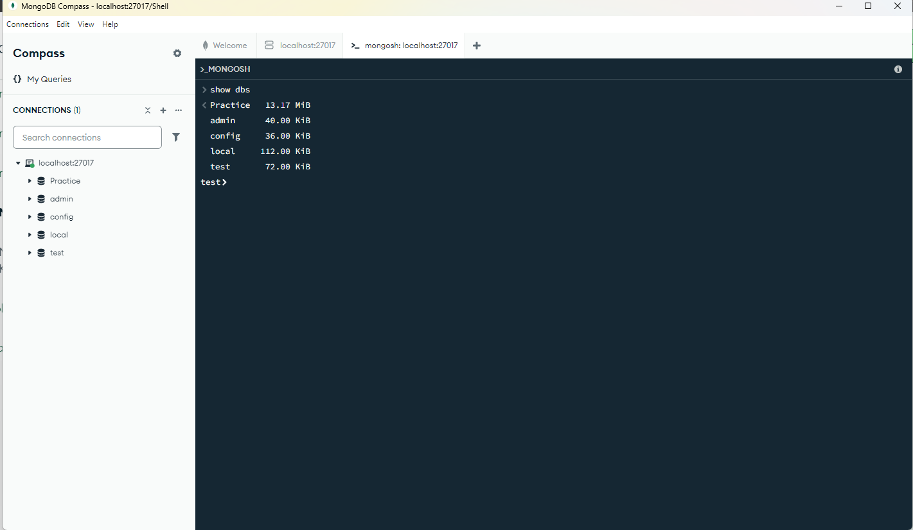

- To show the databases connected we will write

```
show dbs
```

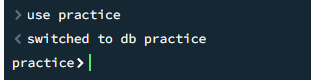

- If we want to create a database we have to write

```
use practice
```

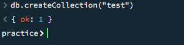

- if we want to create a collection we have to write

```
db.createCollection("test")
```

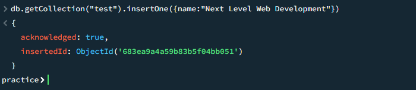

- Now lets get the db collection and insert a data

```
db.getCollection("test").insertOne({name:"Next Level Web Development"})
```

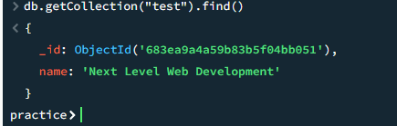

- Now Lets Find The Data

```
db.getCollection("test").find()
```

#### Lets Use The Command Prompt For doing these.

- we have to add the mongoose shell in the path.

[MongoDB Shell](https://www.mongodb.com/try/download/shell)

- go to the path and copy the path

```
C:\Program Files\MongoDB\Server\8.0\bin
```

- Open `Edit Environment Variable`

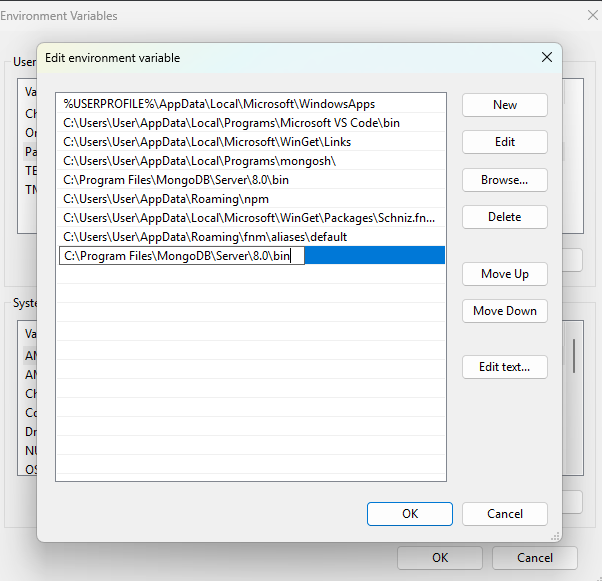

- To see the version

```
mongod --version
```

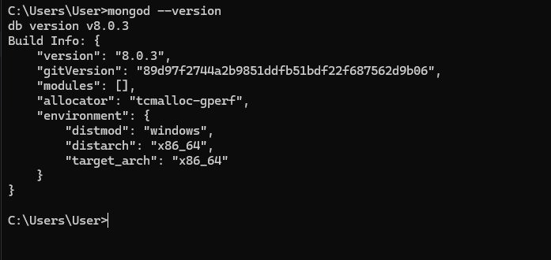

- connect the mongoose

```
mongosh
```

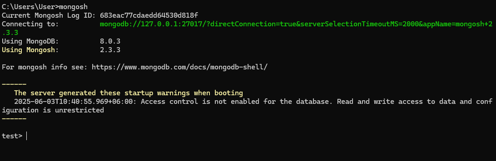

- Show the connected database

```
show dbs
```

- Connect the practice database we have create

```
use practice
```

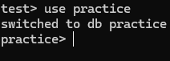

- now lets use the shell

```js
show dbs
use Practice
db.createCollection("Test-1")
db.getCollection("Test-1").insertOne({name:"Sazid"})
db.getCollection("Test-1").find()
```

- Install No SQL Booster

[Nosql Booster Download](https://nosqlbooster.com/)

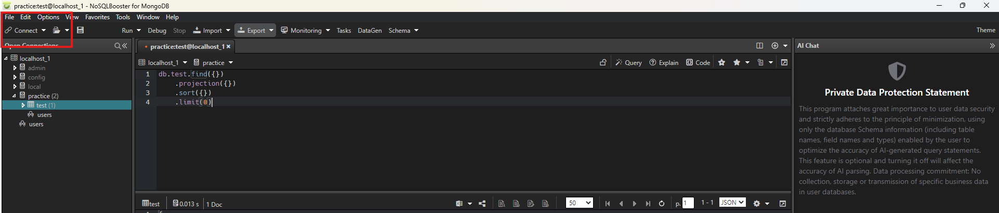

- Connect The Database from here
- get all the data from the database collection

```js
db.test.find({});
```

- write this and press ctrl + enter to run the command

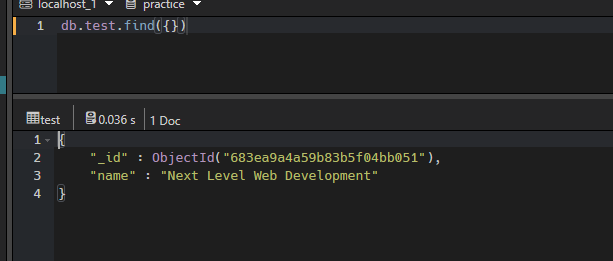

## 15-2 Insert,insertOne, find, findOne, field filtering, project

- We want to insert a data

```js
db.test.insertOne({ name: "something" });
```

- we will not use insert. We will use insertOne since insert is deprecated.
- If we want to insert many data we have to use insertMany

```js
db.test.insertMany([{ name: "jodu" }, { name: "modu" }]);
```

- If we want to find a specific data we have to use findOne

```js
db.test.findOne({ age: 17 });
```

- Suppose we do not want to see some specific fields of document we have to do Field Filtering

```js
db.test.find({ gender: "Male" }, { gender: 1 });
```

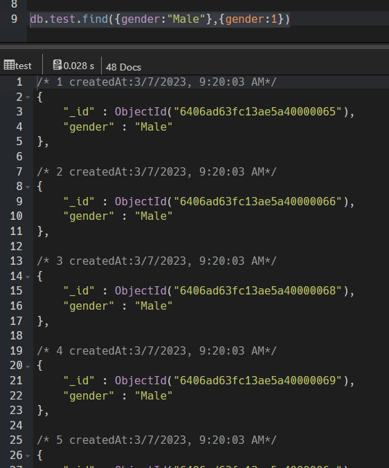

- we can do field filtering as many fields we want

```js
db.test.find({ gender: "Male" }, { name: 1, gender: 1, email: 1 });
```


- we can use this field filtering with find and findOne as well

```js
db.test.find(
  { email: "mdangl1@odnoklassniki.ru" },
  { name: 1, gender: 1, email: 1, phone: 1 }
);
```

- There is an alternative of field filtering named `project`. remember that we can not use the filed Filtering for `findOne`.

```js
db.test
  .find({ gender: "Male" })
  .project({ name: 1, gender: 1, email: 1, phone: 1 });
```

## 15-3 $eq, $neq, $gt, $lt, $gte, $lte

[Mongodb Comparison Operators](https://www.mongodb.com/docs/manual/reference/operator/query-comparison/)

#### $eq Operator

- Structure of defining operator. thumb rule is we have to keep the operator inside {}

```
{ <field>: { $eq: <value> } }
```

- lets see how we can get all the male using the $eq comparison operator

```js
db.test.find({ gender: { $eq: "Male" } });
```

#### $ne Operator

```js
db.test.find({ gender: { $ne: "Male" } });
```

#### $gt & $lt Operator

```js
db.test.find({ age: { $gt: 20 } });
```

```js
db.test.find({ age: { $lt: 20 } });
```

#### $gte & $lte Operator

```js
db.test.find({ age: { $gte: 20 } });
```

```js
db.test.find({ age: { $lte: 20 } });
```

#### sorting (asc desc)

- Ascending sort

```js
db.test.find({ age: { $lt: 20 } }).sort({ age: 1 });
```

- Descending Sort

```js
db.test.find({ age: { $lt: 20 } }).sort({ age: -1 });
```

## 15-4 $in, $nin, implicit and condition

#### Implicit And `,`

- Implicit and means if all the condition is given is true give me the document.
- If we want to merge two condition we have to use `Implicit And`. Suppose we want to find the person aged between 18 and 30 and have to be Female.
- We can join multiple conditions using `,`.

```js
db.test
  .find(
    { gender: "Female", age: { $gte: 18, $lte: 30 } },
    { age: 1, gender: 1 }
  )
  .sort({ age: 1 });
```

#### $in & $nin

- The $in operator selects the documents where the value of a field equals any value in the specified array. That means if any one matches it will give the document.

- structure

```
{ field: { $in: [<value1>, <value2>, ... <valueN> ] } }
```

- Suppose we want to see specific age numbered persons. not like a specific range.

```js
db.test
  .find(
    { gender: "Female", age: { $in: [18, 20, 22, 24, 26, 28, 30] } },
    { age: 1, gender: 1 }
  )
  .sort({ age: 1 });
```

- This can be reversed using $nin

```js
db.test
  .find(
    { gender: "Female", age: { $nin: [18, 20, 22, 24, 26, 28, 30] } },
    { age: 1, gender: 1 }
  )
  .sort({ age: 1 });
```

- Lets match with interests filed

```js
db.test
  .find(
    {
      gender: "Female",
      age: { $nin: [18, 20, 22, 24, 26, 28, 30] },
      interests: "Cooking",
    },
    { age: 1, gender: 1, interests: 1 }
  )
  .sort({ age: 1 });
```

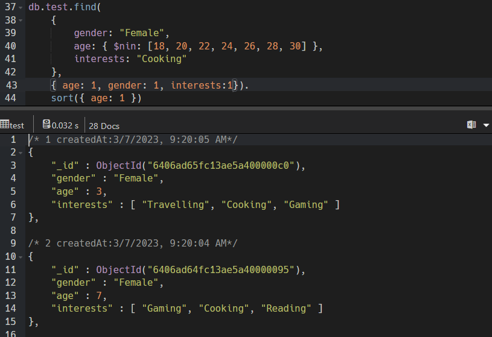

- If want to use the $nin or $in with a array fileds we want to match we can use like this one.
- If any document value matches with the cooking or gaming or both it will show result.

```js
db.test
  .find(
    {
      gender: "Female",
      age: { $nin: [18, 20, 22, 24, 26, 28, 30] },
      interests: { $in: ["Cooking", "Gaming"] },
    },
    { age: 1, gender: 1, interests: 1 }
  )
  .sort({ age: 1 });
```

## 15-5 $and, $or, implicit vs explicit

#### Implicit And

- If we are working in the same filed we have to use `implicit and` separately. we have to keep it under same bracket.
- wrong

```js
db.test.find({age: {$ne : 15}}, age: {$lte : 30})
```

- Correct

```js
db.test.find({ age: { $ne: 15, $lte: 30 } });
```

- It can be done using `Explicit And`

#### Explicit $and

- $and performs a logical AND operation on an array of one or more expressions (<expression1>, <expression2>, and so on) and selects the documents that satisfy all the expressions.

- Structure

```js
{ $and: [ { <expression1> }, { <expression2> } , ... , { <expressionN> } ] }
```

```js
db.test
  .find({
    $and: [{ gender: "Female" }, { age: { $ne: 15 } }, { age: { $lte: 30 } }],
  })
  .project({ age: 1 })
  .sort({ age: 1 });
```

- when there is more nested conditions we have to apply we have to use `Explicit $and` to avoid any error.

#### Explicit $or

- The $or operator performs a logical OR operation on an array of one or more <expressions> and selects the documents that satisfy at least one of the <expressions>.

- Structure

```js
{ $or: [ { <expression1> }, { <expression2> }, ... , { <expressionN> } ] }
```

```js
db.test
  .find({
    $or: [{ gender: "Female" }, { age: { $ne: 15 } }, { age: { $lte: 30 } }],
  })
  .project({ age: 1, gender: 1 })
  .sort({ age: 1 });
```

```js
db.test
  .find({
    $or: [
      {
        interests: "Traveling",
      },
      {
        interests: "Cooking",
      },
    ],
  })
  .project({ age: 1, gender: 1, interests: 1 })
  .sort({ age: 1 });
```

- Now lets think about how to implement conditions in array of object

```js
db.test
  .find({
    $or: [{ "skills.name": "JAVASCRIPT" }, { "skills.name": "PYTHON" }],
  })
  .project({ skills: 1 });
```

- we have to do dot notation and have to keep inside the "".
- Implicit or do the same kind of works we can use it as well since in case of working with same field.

```js
db.test
  .find({
    "skills.name": { $in: ["JAVASCRIPT", "PYTHON"] },
  })
  .project({ skills: 1 });
```

#### $nor

- The $nor operator in MongoDB performs a logical NOR operation. It returns documents that do not match any of the conditions specified.
- Structure

```js
{ $nor: [ { <expression1> }, { <expression2> }, ...  { <expressionN> } ] }
```

#### $not

- $not performs a logical NOT operation on the specified <operator-expression> and selects the documents that do not match the <operator-expression>. This includes documents that do not contain the field.
- Use $not to negate a single condition on a field.
- Structure

```js
{ field: { $not: { <operator-expression> } } }
```

## 15-6 $exists, $type,$size (element Query Operator)

#### $exists

- This Shows If any field really exists in a document or not.
- The $exists operator matches documents that contain or do not contain a specified field, including documents where the field value is null.
- structure

```js
{ field: { $exists: <boolean> } }
```

```js
db.test.find({ phone: { $exists: false } });
```

- There is problem with exists like if any filed is `null, undefined or empty array` we can not find. He will just tell company field exists or not. Does not work with field value.
- This type of `null, undefined or empty array` value can be seen by using `$size`

#### $size

- The $size operator matches any array with the number of elements specified by the argument.

```js
db.test.find({ friends: { $size: 4 } }).project({ friends: 1 });
```

```js
db.test.find({ friends: { $size: 0 } }).project({ friends: 1 });
```

- This will only show the array that have 4 values.
- Remember this works with array only
- If its not a array field we have to use `$type`

```js
db.test.find({ company: { $type: "null" } });
```

#### $type

- $type selects documents where the value of the field is an instance of the specified BSON type(s). Querying by data type is useful when dealing with highly unstructured data where data types are not predictable.
- structure

```js
{ field: { $type: <BSON type> } }
```

```js
db.test.find({ age: { $type: "string" } });
db.test.find({ friends: { $type: "array" } });
```

## 15-7 $all , $elemMatch

- lets learn about, array query, object query, array of object query.

### Array

```js
db.test.find({ interests: "Cooking" }).project({ interests: 1 });
```

- Suppose we have a situation like we have to see the persons who have the Cooking interest in 2nd index position of the array.

```js
db.test.find({ "interests.2": "Cooking" }).project({ interests: 1 });
```

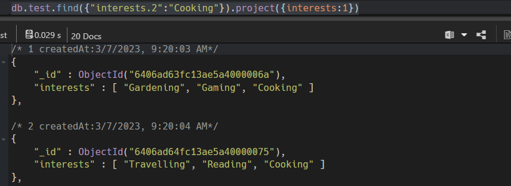

- If we want to match exactly

```js
db.test
  .find({ interests: ["Gardening", "Gaming", "Cooking"] })
  .project({ interests: 1 }); // It will follow the same ordered mentioned and give data
```

#### $all Operator

- If we want to match in more flexible way without maintaining order we need to use $all operator
- The $all operator selects the documents where the value of a field matches all specified values. The matched documents can either contain a field with a value that is an array containing all the specified elements, or a field with a single value matching the specified element.

- Structure

```js
{ <field>: { $all: [ <value1> , <value2> ... ] } }
```

```js
db.test
  .find({ interests: { $all: ["Travelling", "Gaming", "Reading"] } })
  .project({ interests: 1 });
```

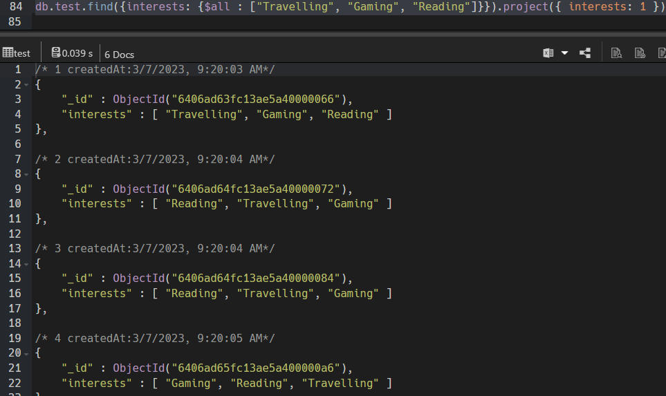

- 3 values will be there just the position will be flexible.

### Array Of Object

- we can find object as the same way as array.
- This will exactly match the skills, order have to be same and so value should be missing.

```js
db.test
  .find({
    skills: {
      name: "JAVASCRIPT",
      level: "Expert",
      isLearning: false,
    },
  })
  .project({ skills: 1 });
```

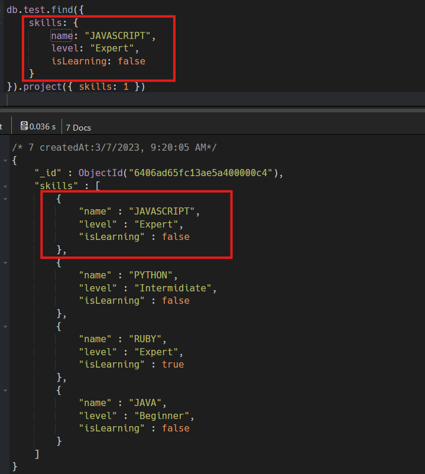

#### $elemMatch

- If we want to enjoy flexibility we have to use $elemMatch
- Structure

```js
{ <field>: { $elemMatch: { <query1>, <query2>, ... } } }
```

```js
db.test
  .find({ skills: { $elemMatch: { name: "JAVASCRIPT", level: "Expert" } } })
  .project({ skills: 1 });
```

## 15-8 $set, $addToSet, $push,

#### $set

- The $set operator replaces the value of a field with the specified value.
- Structure

```js
{ $set: { <field1>: <value1>, ... } }
```

- Dummy Code

```js
db.products.updateOne(
  { _id: 100 },
  {
    $set: {
      quantity: 500,
      details: { model: "2600", make: "Fashionaires" },
      tags: ["coats", "outerwear", "clothing"],
    },
  }
);
```

- Meaning

```js
db.test.updateOne(
    {kake update korbo},
    { $set: {ki update korbo} },
    {Options like }
)
```

- Updating age

```js
db.test.updateOne(
  { _id: ObjectId("6406ad63fc13ae5a40000065") },
  { $set: { age: 22 } }
);
```

- $set replaces the field with new update things. This works meaningful only for primitive data type. if its a non primitive data(array) type its not meaningful. We can use $set for non primitive only if we want to replace intentionally.

```js
db.test.updateOne(
  { _id: ObjectId("6406ad63fc13ae5a40000065") },
  { $set: { interests: ["Gaming", "Cooking"] } }
);
```

- It will replace the array with the new array valued array.

#### $addToSet

- For updating non-primitive data we will use $addToSet. This will set inside the array keeping `no duplicates`.
- The $addToSet operator adds a value to an array unless the value is already present, in which case $addToSet does nothing to that array.
- Structure

```js
{ $addToSet: { <field1>: <value1>, ... } }
```

```js
db.test.updateOne(
  { _id: ObjectId("6406ad63fc13ae5a40000065") },
  { $addToSet: { interests: "Sleeping" } }
);
```

##### $each Modifier

- The $each modifier allows the $addToSet operator to add multiple values to the array field.

```js
db.test.updateOne(
  { _id: ObjectId("6406ad63fc13ae5a40000065") },
  { $addToSet: { interests: { $each: ["Ghum", "Khawa"] } } }
);
```

- This will Not Duplicate the things

#### $push Operator

- If we want to keep the duplicates we have to use $push
- Structure

```js
{ $push: { <field1>: { <modifier1>: <value1>, ... }, ... } }
```

```js
db.test.updateOne(
  { _id: ObjectId("6406ad63fc13ae5a40000065") },
  { $push: { interests: { $each: ["Ghum", "Khawa"] } } }
);
```

## 15-9 $unset, $pop, $pull, $pullAll

#### $unset

- The $unset operator deletes a particular field.
- structure

```js
{ $unset: { <field1>: "", ... } }
```

- We can remove like this too.

```js
db.test.updateOne(
  { _id: ObjectId("6406ad63fc13ae5a40000065") },
  { $unset: { age: 1 } }
);
```

#### $pop

- If we want too remove something from array we have to use array update operator
- structure

```js
{ $pop: { <field>: <-1 | 1>, ... } }
```

- here 1 means it will remove last element of array
- here -1 means it will remove from first element of the array

```js
db.test.updateOne(
  { _id: ObjectId("6406ad63fc13ae5a40000065") },
  { $pop: { friends: -1 } }
);
```

```js
db.test.updateOne(
  { _id: ObjectId("6406ad63fc13ae5a40000065") },
  { $pop: { friends: 1 } }
);
```

#### $pull

- If we want to pull a specific element by name and remove we have to use $pull operator
- structure

```js
{ $pull: { <field1>: <value|condition>, <field2>: <value|condition>, ... } }
```

```js
db.test.updateOne(
  { _id: ObjectId("6406ad63fc13ae5a40000065") },
  { $pull: { friends: "Mir Hussain" } }
);
```

##### $pullAll

- If we want to pull multiple elements from an array we have to use $pullAll
- structure

```js
{ $pullAll: { <field1>: [ <value1>, <value2> ... ], ... } }
```

```js
db.test.updateOne(
  { _id: ObjectId("6406ad63fc13ae5a40000065") },
  { $pullAll: { friends: ["Fahim Ahammed Firoz", "Tanmoy Parvez"] } }
);
```

## 15-10 More about $set, how to explore documentation

- lets Update a object
- for primitive type and non primitive object we can use $set

```js
db.test.updateOne(
  { _id: ObjectId("6406ad63fc13ae5a40000065") },
  { $set: { "address.city": "Dhaka" } }
);
```

- There may be multiple fields or single field

```js
db.test.updateOne(
  { _id: ObjectId("6406ad63fc13ae5a40000065") },
  {
    $set: {
      "address.street": "Atipara",
      "address.city": "Dhaka",
      "address.country": "Bangladesh",
    },
  }
);
```

#### $ (update) operator

[Updating Array Of Object](https://www.mongodb.com/community/forums/t/mongodb-update-a-value-in-array-of-object-of-array/208302)
[$ (update) operator](https://www.mongodb.com/docs/manual/reference/operator/update/positional/)

- To Update an array of object we have to use positional operator $ . this ensures only one document will be updated.
- The positional $ operator identifies an element in an array to update without explicitly specifying the position of the element in the array.

```js
db.test.updateOne(
  { _id: ObjectId("6406ad63fc13ae5a40000065"), "education.major": "Art" },
  { $set: { "education.$.degree": "Arts With Sazid" } }
);
```

- It will match the elements of an array and will interact with the first element he found. no matter other matching element exists.

#### $inc

- The $inc operator increments a field by a specified value.
- structure

```js
{ $inc: { <field1>: <amount1>, <field2>: <amount2>, ... } }
```

```js
db.test.updateOne(
  { _id: ObjectId("6406ad63fc13ae5a40000065") },
  { $inc: { age: 3 } }
);
```

## 15-11 delete documents, drop collection and how to explore by yourself

- If we want to delete a document we have to use deleteOne

```js
db.test.deleteOne({ _id: ObjectId("6406ad63fc13ae5a40000065") });
```

- If we want to create a new collection

```js
db.createCollection("Posts");
```

- If we want to drop a collection

```js
db.posts.drop({ writeConcern: { w: 1 } });
```

or

```js
db.Posts.drop();
```
