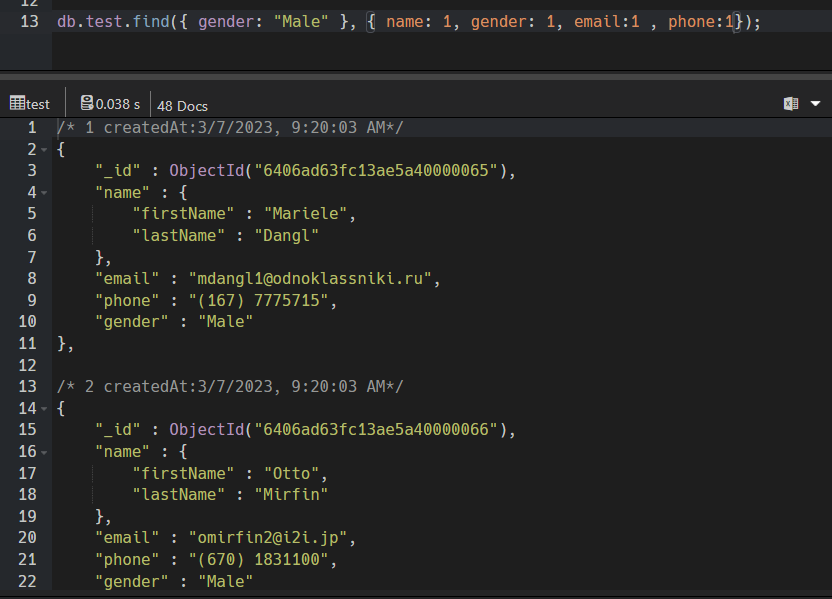

# In-Depth-Exploration-Of-MongoDB-Queries

Practice Data: https://github.com/Apollo-Level2-Web-Dev/mongodb-practice

Get ready to unlock the secrets of Mongoose, your key to mastering MongoDB in the Node.js world. This course will turn you into a data boss, teaching you how to add, search for, and change your information with ease.

Let's delve into the exciting journey that will make you a Mongoose master! Here's what you'll explore,

1. Install MongoDB compass & No SQL Booster ( windows, Mac & Linux): Before we dive in, we'll show you how to install the tools you need: MongoDB Compass & NoSQL Booster (think of them as fancy flashlights for your data). We'll have instructions for Windows, Mac, and Linux users.

2. insert, insertOne, find, findOne, field filtering, project: Dive into the fundamentals of inserting data into your MongoDB collections using insert and insertOne methods Master retrieving data. Explore the find method for retrieving multiple documents and findOne for fetching a single document. Learn how to filter specific fields from your retrieved documents using field filtering and projection techniques.

3. $eq, $neq, $gt, $lt, $gte, $lte: Unleash the power of comparison operators like $eq (equal to), $neq (not equal to), $gt (greater than), and more to pinpoint the exact data you need.

4. $in, $nin, implicit and condition: $in (included in) and $nin (not included in) operators for precise data selection. We'll also delve into implicit and conditional logic for crafting complex queries.

5. $and, $or, implicit vs explicit: learn how to combine multiple conditions using $and and $or operators to fine-tune your data retrieval. We'll cover both implicit and explicit ways to combine conditions for maximum flexibility.

6. $exists, $type,$size: Discover operators like $exists, $type, and $size for detailed data inspection.

7. $all , $elemMatch: Master array manipulation with operators like $all, $elemMatch.

8. $set, $addToSet, $push: Explore operators like $set for updating existing field values, $addToSet for adding unique elements to an array, and $push for adding elements to an array regardless of uniqueness.

9. $unset, $pop, $pull, $pullAll: Learn how to remove specific fields using $unset, remove the last element from an array with $pop, and target specific elements for removal using $pull and $pullAll.

10. More about $set: We'll also delve deeper into the nuances of $set for advanced usage scenarios.

11. Delete documents, drop collection and how to explore by yourself: Discover how to delete specific documents based on criteria. Learn how to completely remove a collection from your database. We'll equip you with strategies for effectively navigating the official Mongoose documentation to explore advanced features and functionalities on your own.

By diligently following this path and practicing the techniques you learn, you'll be well on your way to becoming a Mongoose Master and confidently managing your MongoDB data!Practice Data: https://github.com/Apollo-Level2-Web-Dev/mongodb-practice

## 15-1-A Install MongoDB compass & No SQL Booster ( windows)

## What is Mongodb ?

- It is a noSql Database Storing Data in json like documents. It Break from traditional relational model, ideal for managing vast data. its for sclaibility flexibility and performance

# MongoDB vs Traditional Relational Databases

| Feature               | MongoDB (NoSQL)                                    | Traditional Relational Databases (SQL)          |
| --------------------- | -------------------------------------------------- | ----------------------------------------------- |
| **Data Structure**    | Document-based (JSON-like BSON)                    | Table-based (rows & columns)                    |
| **Schema**            | Flexible (Schema-less)                             | Fixed schema (Strict structure)                 |
| **Scalability**       | Horizontal (Sharding) & Vertical                   | Vertical (Adding more resources)                |
| **Query Language**    | MongoDB Query Language (MQL)                       | SQL (Structured Query Language)                 |
| **Performance**       | Faster for unstructured data & big data            | Optimized for structured data & complex queries |
| **Joins**             | Not natively supported (uses embedding or $lookup) | Supports JOIN operations natively               |
| **Transactions**      | Limited multi-document transactions                | Strong ACID compliance with full transactions   |
| **Use Cases**         | Big data, real-time apps, IoT, flexible data       | Banking, e-commerce, ERP, structured data       |
| **Example Databases** | MongoDB, CouchDB, Firebase                         | MySQL, PostgreSQL, Oracle, SQL Server           |

## RDBMS VS MONGODB

| RDBMS   | MONGODB    |
| ------- | ---------- |
| TABLE   | COLLECTION |
| ROWS    | DOCUMENT   |
| COLUMNS | FIELDS     |

[Mongodb Download Link](https://www.mongodb.com/try/download/community)

- Download This and install Mongodb


- To show the databases connected we will write

```
show dbs
```


- If we want to create a database we have to write

```
use practice
```


- if we want to create a collection we have to write

```
db.createCollection("test")
```


- Now lets get the db collection and insert a data

```
db.getCollection("test").insertOne({name:"Next Level Web Development"})
```


- Now Lets Find The Data

```
db.getCollection("test").find()
```

#### Lets Use The Command Prompt For doing these.

- we have to add the mongoose shell in the path.

[MongoDB Shell](https://www.mongodb.com/try/download/shell)

- go to the path and copy the path

```
C:\Program Files\MongoDB\Server\8.0\bin
```

- Open `Edit Environment Variable`


- To see the version

```
mongod --version
```


- connect the mongoose

```
mongosh
```


- Show the connected database

```
show dbs
```

- Connect the practice database we have create

```
use practice
```


- now lets use the shell

```js
show dbs
use Practice
db.createCollection("Test-1")
db.getCollection("Test-1").insertOne({name:"Sazid"})
db.getCollection("Test-1").find()
```

- Install No SQL Booster

[Nosql Booster Download](https://nosqlbooster.com/)


- Connect The Database from here
- get all the data from the database collection

```js
db.test.find({});
```

- write this and press ctrl + enter to run the command


## 15-2 Insert,insertOne, find, findOne, field filtering, project

- We want to insert a data

```js
db.test.insertOne({ name: "something" });
```

- we will not use insert. We will use insertOne since insert is deprecated.
- If we want to insert many data we have to use insertMany

```js
db.test.insertMany([{ name: "jodu" }, { name: "modu" }]);
```

- If we want to find a specific data we have to use findOne

```js
db.test.findOne({ age: 17 });
```

- Suppose we do not want to see some specific fields of document we have to do Field Filtering

```js
db.test.find({ gender: "Male" }, { gender: 1 });
```


- we can do field filtering as many fields we want

```js
db.test.find({ gender: "Male" }, { name: 1, gender: 1, email: 1 });
```



- we can use this field filtering with find and findOne as well

```js
db.test.find(
  { email: "mdangl1@odnoklassniki.ru" },
  { name: 1, gender: 1, email: 1, phone: 1 }
);
```

- There is an alternative of field filtering named `project`. remember that we can not use the filed Filtering for `findOne`.

```js
db.test
  .find({ gender: "Male" })
  .project({ name: 1, gender: 1, email: 1, phone: 1 });
```
